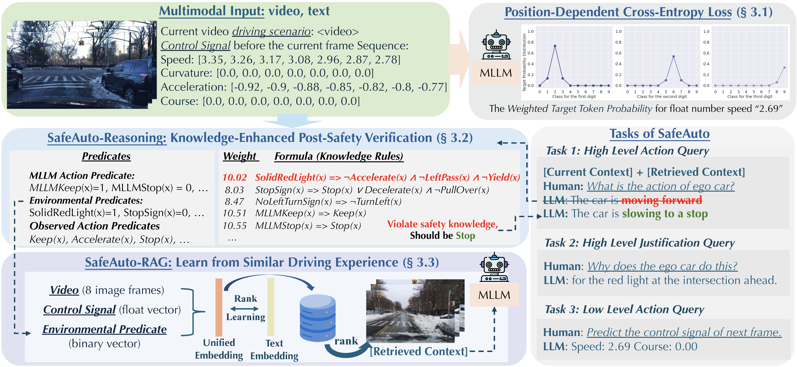
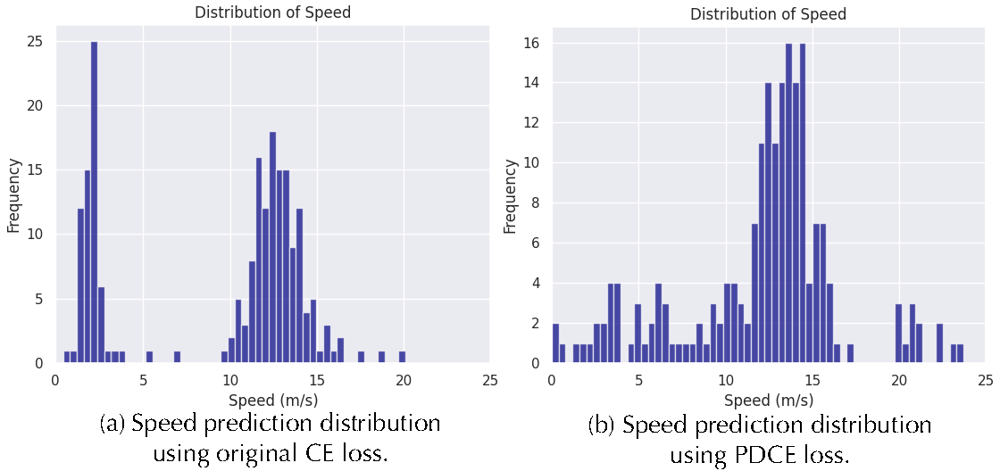
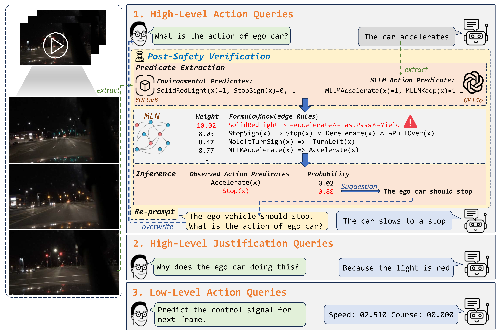

<div align="center">


# SafeAuto: Knowledge-Enhanced Safe Autonomous Driving with Multimodal Foundation Models

[](https://arxiv.org/abs/2503.00211)
[](https://arxiv.org/abs/2503.00211)
[](https://opensource.org/licenses/Apache-2.0)
[](https://www.python.org/)
[](https://pytorch.org/)

</div>

## 🚗 Overview

Traditional autonomous driving systems often struggle to connect high-level reasoning with low-level control, leading to suboptimal and sometimes unsafe behaviors. Recent advances in multimodal large language models (MLLMs), which process both visual and textual data, offer an opportunity to unify perception and reasoning. However, effectively embedding precise safety knowledge into MLLMs for autonomous driving remains a significant challenge.

SafeAuto addresses this challenge through a comprehensive framework that enhances MLLM-based autonomous driving with three key innovations: (1) a Position-Dependent Cross-Entropy (PDCE) loss to improve low-level control signal predictions when values are represented as text, (2) a reasoning component that translates traffic rules into first-order logic and embeds them into probabilistic graphical models to verify predicted actions, and (3) a Multimodal Retrieval-Augmented Generation (RAG) model that learns from past driving experiences using video, control signals, and environmental attributes.

### Key Features

- **🎯 Position-Dependent Cross-Entropy (PDCE) Loss**: Improves numerical prediction accuracy for control signals while maintaining autoregressive capabilities
- **🧠 Knowledge-Enhanced Post-Safety Verification**: Uses Markov Logic Networks (MLNs) to verify predicted actions against traffic rules
- **📚 Multimodal RAG**: Leverages past driving experiences from video, control signals, and environmental attributes
- **🛡️ Safety-First Design**: Explicit integration of traffic rules and safety constraints into the decision-making process

## 🏗️ Architecture



SafeAuto consists of three main components:

1. **PDCE Loss Module**: Handles precise numerical predictions for control signals
2. **MLN Verification Module**: Verifies high-level actions against structured traffic rules
3. **Multimodal RAG Module**: Incorporates relevant past experiences for context-aware decisions

## 🔧 Installation

### Prerequisites

- Python 3.10
- CUDA 11.8+ (recommended for deepspeed compatibility)

### Setup

```bash
# Clone the repository
git clone https://github.com/AI-secure/SafeAuto.git
cd SafeAuto

# Create conda environment
conda create -n safeauto python=3.10
conda activate safeauto

# Install dependencies
pip install -r requirements.txt

# Install flash-attention
pip install flash-attn --no-build-isolation

```

### Dataset

We provide a bash script to automatically download and extract all required datasets (BDDX and DriveLM).
Make sure git and git-lfs are installed and initialized:
```bash
## if you haven't installed the git-lfs
sudo apt update && sudo apt install git git-lfs
git lfs install

## download the dataset
bash scripts/download_datasets.sh
```

After downloading, you should see under `data/` there should be `BDDX_Processed`, `BDDX_Test`, `DriveLM_train`, `DriveLM_val`.

### Base Models
We provide a bash script to automatically setup all base checkpoints.
Make sure git and git-lfs are installed and initialized:
```bash
## if you haven't installed the git-lfs
sudo apt update && sudo apt install git git-lfs
git lfs install

## download the base models
bash scripts/download_base.sh
```

### Pretrained Models

We also provide some pretrained SafeAuto models on HuggingFace:

- **BDD-X Dataset**: [SafeAuto-BDDX](https://huggingface.co/javyduck/SafeAuto-BDDX)
- **DriveLM Dataset**: [SafeAuto-DriveLM](https://huggingface.co/javyduck/SafeAuto-DriveLM)

## 🚀 Quick Start

### Training

```bash
# Parameters:
# - init_sigma: Initial sigma for PDCE loss (e.g., 0.01)
# - final_sigma: Final sigma for PDCE loss (e.g., 0.35)  
# - rag: Enable RAG (true/false)
# - topk: Top-k retrieval for RAG (only if rag=true)

# on bddx dataset
bash scripts/finetune_bddx.sh 0.01 0.35 true 2
# on drivelm dataset
bash scripts/finetune_drivelm.sh 0.01 0.35 true 1
```

### Inference
It will load the finetuned model and do the inference on the evaluation dataset.

```bash
# Parameters:
# - init_sigma: Initial sigma for PDCE loss (e.g., 0.01)
# - final_sigma: Final sigma for PDCE loss (e.g., 0.35)  
# - rag: Enable RAG (true/false)
# - topk: Top-k retrieval for RAG (only if rag=true)

# on bddx dataset
bash scripts/eval_bddx.sh 0.01 0.35 true 2
# on drivelm dataset
bash scripts/eval_drivelm.sh 0.01 0.35 true 1
```

[TODO: add the code for safety verification]

### Evaluation
Get the accuracy of the prediction on high level/ low level prediction.

```bash
# Evaluate high level
python evaluate_bddx.py --path bddx_0.01-0.35_rag_top2 --caption

# Evaluate low level
python evaluate_bddx.py --path bddx_0.01-0.35_rag_top2 --signal
```

[TODO] Add evaluation script on drivelm.

## 🧮 Training from Scratch

This section illustrates how to train a SafeAuto model from scratch. The complete training pipeline consists of the following steps:

### Training Pipeline Overview

1. **PGM Training & Environment Predicate Collection**
   - Train the Probabilistic Graphical Model (PGM) 
   - Collect environment predicate vectors for RAG training

2. **Multimodal RAG Training**
   - Use multimodal signals (images, low-level control signals, environment predicates)
   - Train the RAG model and generate top-k retrieval examples
   - Note: The retrieval database consists solely of the **training data**

3. **Conversation Construction**
   - Construct conversations augmented with RAG context
   - Prepare training data with retrieved similar driving experiences

4. **Model Fine-tuning w/ PDCE loss**
   - Fine-tune the base model using PDCE loss on the augmented conversations
   - Incorporate both high-level reasoning and low-level control signal prediction

5. **Inference with Safety Verification**
   - Perform inference on the evaluation dataset
   - Apply PGM safety verification to ensure traffic rule compliance


**Modular Training:** You can start from any step in this pipeline or use only specific components based on your needs. Each component is designed to be modular and can be trained independently.

---

### 🔧 Step-by-Step Training Instructions

#### 1. PGM Training & Environment Predicate Collection

Here we use Markov Logic Networks (MLNs), which are a type of Probabilistic Graphical Model (PGM). MLNs encode traffic rules as first-order logic formulas and verify predicted actions:

```prolog
# Example traffic rules
SolidRedLight(x) ⇒ ¬Accelerate(x) ∧ ¬LeftPass(x)
StopSign(x) ⇒ Stop(x) ∨ Decelerate(x)
NoLeftTurnSign(x) ⇒ ¬TurnLeft(x)
```

*[TODO: Instructions for training the Probabilistic Graphical Model and collecting environment predicate vectors will be added here]*

#### 2. Multimodal RAG Training

The RAG module retrieves similar driving experiences based on:
- **Visual similarity**: Video frame content
- **Control signal similarity**: Speed and steering patterns  
- **Environmental attributes**: Traffic signs, road conditions

Train the Retrieval-Augmented Generation model using multimodal signals (we also have prepared the trained rag projector under `retrieval/ckpts`):

```bash
# Train RAG model on BDD-X dataset
python retrieval/main.py --dataset bddx --num_epochs 100 --batch_size 2048

# Train RAG model on DriveLM dataset
python retrieval/main.py --dataset drivelm --num_epochs 50 --batch_size 512
```

The RAG training process:
- Uses multimodal signals: images, low-level control signals, and environment predicates
- Generates top-k retrieval examples from the training data

#### 3. Conversation Construction

Construct training conversations augmented with RAG context. Note that we use consistent digit formatting for floating-point numbers in PDCE loss training. For example, with 2 integer digits and 3 fractional digits, the float "-1.2" is transformed to the string "-01.200":


```bash
# For BDD-X dataset
python data/create_conversation_bddx.py --rag --top_k 2  --decimal 2 --fractional 3

# For DriveLM dataset
python data/create_conversation_drivelm.py --rag --top_k 1  --decimal 2 --fractional 2
```

This step:
- Augments conversations with relevant context from retrieved examples
- Prepares the final training data with RAG-enhanced conversations

#### 4. Model Fine-tuning w/ PDCE Loss

PDCE loss addresses the limitation of standard cross-entropy loss for numerical predictions by incorporating two key principles:

1. **Digit-Level Proximity**: Digits closer to the target incur lower loss
2. **Place-Level Importance**: More significant digit positions have greater influence

**Implementation Details**: The PDCE loss implementation with comprehensive annotations can be found in [`llava/model/language_model/llava_llama.py`](https://github.com/AI-secure/SafeAuto/blob/main/llava/model/language_model/llava_llama.py#L154).



The figure above shows the key advantage of PDCE loss: it creates a single-peak distribution centered around the target value (similar to MSE loss), while the original CE loss produces multi-peak distributions. This means predictions closer to the target value will have smaller loss, encouraging more accurate numerical predictions.

Fine-tune the base model using Position-Dependent Cross-Entropy (PDCE) loss:

```bash
# Fine-tune on BDD-X dataset
bash scripts/finetune_bddx.sh 0.01 0.35 true 2

# Fine-tune on DriveLM dataset
bash scripts/finetune_drivelm.sh 0.01 0.35 true 1
```

#### 5. Inference with Safety Verification



The case study above demonstrates how our safety verification system works in practice. The MLN evaluates predicted actions against encoded traffic rules and environmental constraints, correcting potentially unsafe decisions to ensure compliance with traffic regulations.

Perform inference on the evaluation dataset with PGM safety verification:

```bash
# Inference on BDD-X dataset
bash scripts/eval_bddx.sh 0.01 0.35 true 2

# Inference on DriveLM dataset
bash scripts/eval_drivelm.sh 0.01 0.35 true 1
```

[TODO: add the instruction for safety verification]

This step:
- Loads the fine-tuned model
- Performs inference on the evaluation dataset
- Applies PGM safety verification to ensure traffic rule compliance
- Generates predictions with safety constraints

---

## 📄 Citation

If you use SafeAuto in your research, please cite our paper:

```bibtex
@article{zhang2025safeauto,
  title={Safeauto: Knowledge-enhanced safe autonomous driving with multimodal foundation models},
  author={Zhang, Jiawei and Yang, Xuan and Wang, Taiqi and Yao, Yu and Petiushko, Aleksandr and Li, Bo},
  journal={arXiv preprint arXiv:2503.00211},
  year={2025}
}
```

## 🏆 Acknowledgments

This repository is built upon [RAG-Driver](https://github.com/YuanJianhao508/RAG-Driver). We thank the authors for their open-source data and codebase contributions. We also thank [Nuro](https://www.nuro.ai/) for their support on this project.

